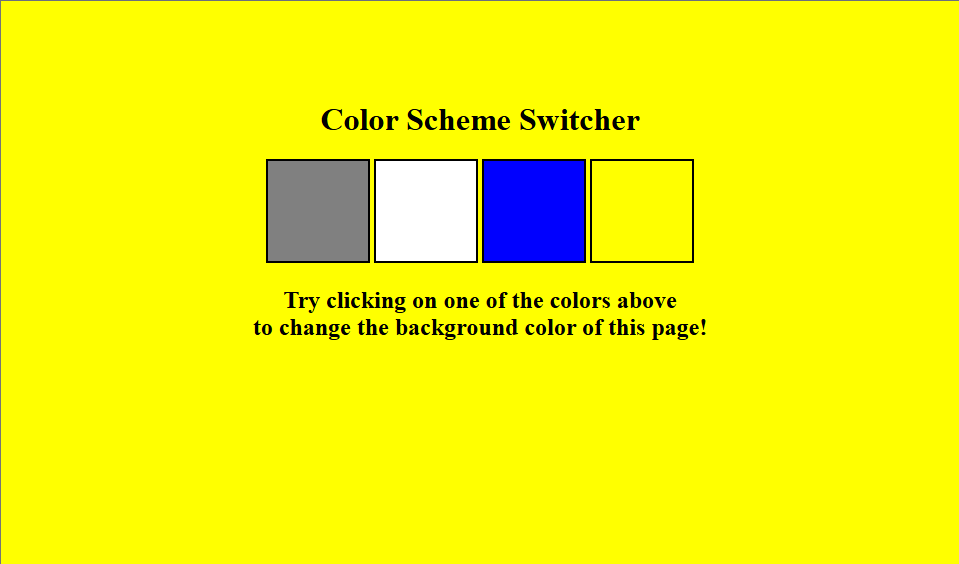

# JAVASCRIPT_PRACTICE_PROJECTS

## Project 1
### This project is basically a normal static website where you have your choices of colors which you can use to change the background of the page like in the image below

_Background color changing website_

[PROJECT LINK](/workspaces/JAVASCRIPT_PRACTICE_PROJECTS/PROJECT_1)

## Project 2
### This project is a BMI (Body Mass Index) Calculator which helps to calculate the BMI of a person you just need to enter the Height in cm and Weight in Kg and you will get you BMI and also the review that it is Healthy, Underweight or Overweight
